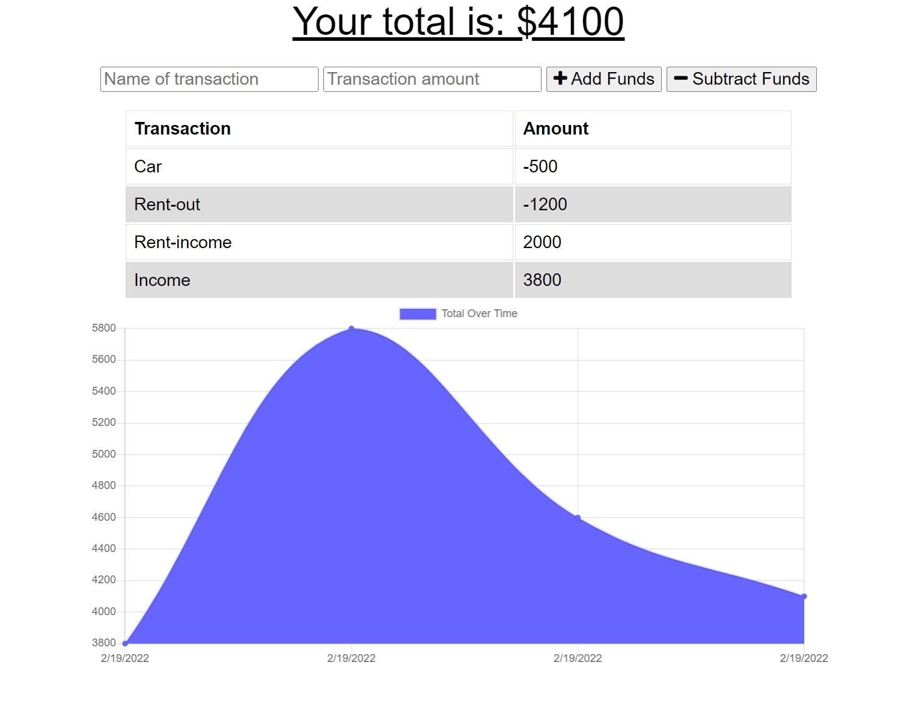

# Budget_Tracker

This app helps user to track their current budget and money flow. User can name the transcation, amount, and choose if this transcation is an income or spending. After each input, the current budget will calculate and show on the yop and on the graph. The graph shows the date so it is easier for user to track their budget.
[Deployed Application](https://budget-tracker-maggie9685.herokuapp.com/)

#### The app looks like the following

## Tech used
* Express
* Mongoose

## License
Licensed under the MIT license.
